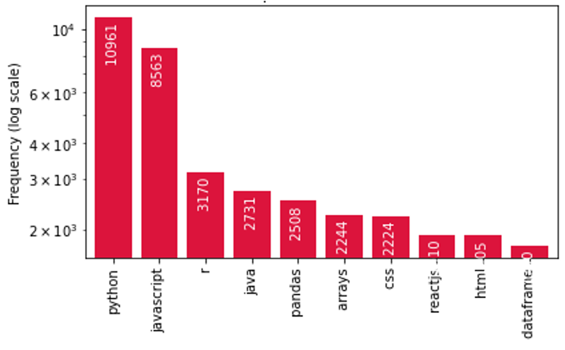
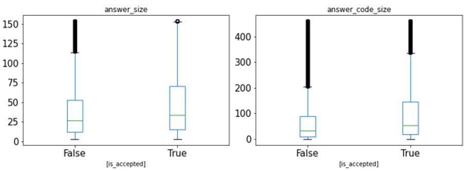
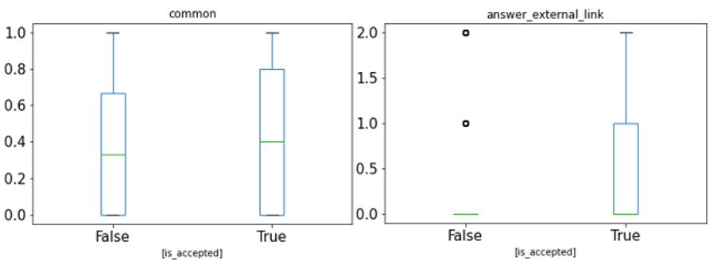
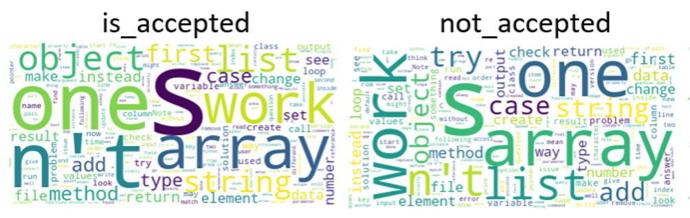
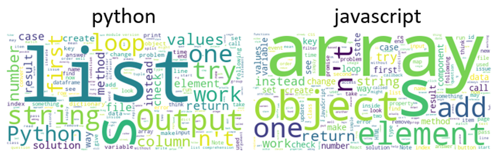
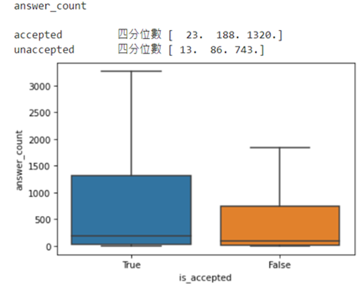
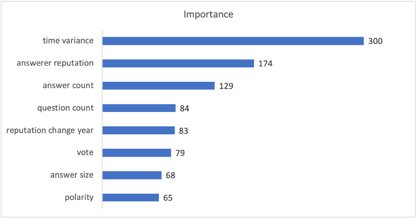
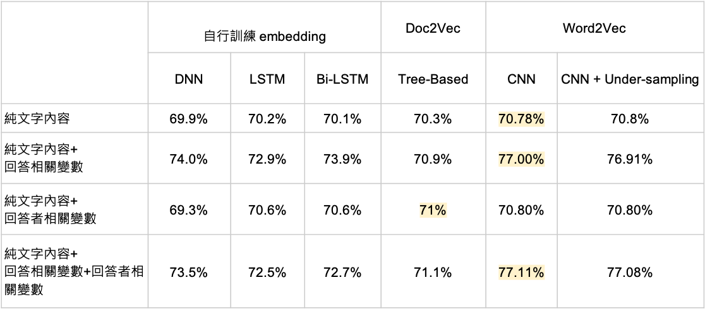
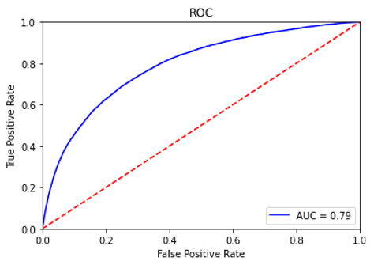

# community-QA-prediction
預測 Stack Overflow 的答題品質以及相關重要特徵分析

## 研究動機
- 使用者面向：在 stack-overflow 這樣的問答社群中，我們都會先參考最佳解答，也通常能夠解決疑問。然而，針對一些沒有明顯較佳解答的問題，使用者需要花費心力去嘗試所有可能解答，降低解決疑問的效率。
- 答題者面向：在有他人向自己的回答投票以前，答題者無法得知自己的回覆是否足夠好，使得別人願意投票給該回覆，因此透過事先預測，將有助於自我評估與改善。

## 研究目標
本研究的目標為找出被高度肯定的答案之特徵，並進一步對提交的回答預先評分，讓答題者能評估其回答品質，而平台方則能根據評分結果調整回覆的排列順序，推薦更適合的答案。以下就答題者、提問者、平台三方面說明「預先評估答題品質」的重要性及其影響：
- 答題者：
  - 藉由預先評估，答題者可參考分數及建議的重要特徵修改要提交的答案，提升品質以增加被提問者接受的機率。
- 提問者：
  - 透過預測能讓提問者或其他使用者在提問初期，如票數較少或尚未有答案被接受時，更易找到最佳解。
- 平台：
  - 預先評估可以增進平台的使用者體驗，也能增加使用者的活躍度。
  - StackOverflow 的另一大目的是記錄常見問題，若答題者能積極提升答題品質，平台上的資訊品質也會相應提升，對未來的使用者帶來更多幫助。
  - 對於造訪的使用者而言，平台能提早推薦潛在的最佳解答，在多個答案同票的情形下，也能列出推薦順序。

## 任務介紹
- 以 StackOverflow 的問答紀錄為資料，建立模型預測答題被接受與否，並分析高品質回答的重要特徵。

## 文獻探討
- 潛在問題 [4]
  - 以得票數作為排序依據，較先回覆的答案有更多的曝光時間得到高票數而被接受，高品質但較晚才成立的回答則不易曝光 → 回答串的排序方式並非是最有效率的
  - 有接近一半的問題因未被標註而沒有 best answer
- 最佳回答與得票數的關係 [5]
  - 81% 的問題中為相同的答案
  - 提文者有多 3 倍的機率選擇 top-voted answer
  - community 傾向支持 best answer
- 辨認最佳回答者 [2]
  - 採用貝氏統計模型
  - 以Latent Dirichlet Allocation辨認「回答者以往的回覆內容」與「問題本身的文字內容」在主題上的相符程度，以預測成為最佳回答者的機率
- 辨認最佳回答 [6]
  - 分析回答的 3 大類特徵：user、content、thread
  - 對不同類型的論壇分別辨認出最具影響力的因素
  - 指出 tree-based 對於最佳回答的辨認成效是最佳的
- 預測回答得票數 [4]
  - 認為人工萃取的特徵並不足以找到最佳回答、模型選擇與參數調整對於預測表現至關重要
  - 3-CNN + dropout + 500 epochs + MSE
  - input僅放入回答的文字內容，完全略過特徵篩選
  - n-gram(n=3,4,5) 的方式作 convolution 能達到內涵語意擷取的作用
- 特徵
  - 文字內容：回答內容、回答與評論的情感分析、回答的極性、問答文字的相似度、以往的回覆內容與問題主題的相符程度
  - 陳述品質：程式碼長度、外部連結、回答字數、大寫比例、可讀性
  - 使用者：聲望值、badge 個數、以往回覆主題、用戶資歷
  - 其他資料：回覆時間間隔、個別回答的得票比例、評論數、閱讀次數

## 資料集來源
透過 StackAPI 爬蟲取得訓練資料集，我們搜集了網站 2021/1/1 至 2021/12/31 日，一年間的問答相關資料，除了選擇具有被接受回答的題目外，並剔除回答數小於三則的問題，以確保所取得的問答資料皆有足夠的資訊且不會有問題未被接受的狀況。

## 特徵介紹
- 問題方面

欄位           | 資料型態  | 欄位內容 |
--------------|-----|------------------------
question_id    | int |  問題的 id |
question_title    | string |  問題的標題 |
question_body  | string | 問題的內容 |
asker_id    | int |  提問者的 id |
question_creation_date    | int(timestamp) |  問題建立時間 |
question_last_activity_date    | int(timestamp) | 問題有變動的時間 |
question_last_edit_date    | int(timestamp) |  問題編輯的時間 |
question_tags    | list |  問題標記的 tag|
question_code_size    | int |  code 的字數 |
question_body_original    | string |  問題的原始內容 |

觀察資料集中 tag 分佈

- 回答方面

|     欄位    | 資料型態 |       欄位內容       |
|:-----------:|:--------:|:--------------------:|
|        is_accepted        |    bool   | 回答是否被提問者接受                                             |   |   |
|    answer_creation_date   | timestamp | 回答建立的時間                                                   |   |   |
| answer_last_activity_date | timestamp | 回答有變動的時間                                                 |   |   |
|   answer_last_edit_date   | timestamp | 回答編輯的時間                                                   |   |   |
|         answer_age        |   float   | answer_creation_date - question_creation_date                    |   |   |
|         answer_id         |    int    | 回答的 id                                                         |   |   |
|        answerer_id        |    int    | 回答者的 id                                                       |   |   |
|    answerer_reputation    |    int    | 回答者在回答當下的聲望值(回答者的聲望值會隨時間改變)             |   |   |
|        question_id        |    int    | 回答所對應到的問題的 id                                           |   |   |
|        answer_link        |   string  | 回答所在的網頁連結                                               |   |   |
|    answer_external_link   |    int    | 回答所擁有的外部連結個數(即共有幾個 <a href=> 形式的 html tag)      |   |   |
|        answer_score       |    int    | 回答的得票數                                                     |   |   |
|      answer_score_sum     |    int    | 單一問題下所有回答的總得票數                                     |   |   |
|     answer_score_ratio    |   float   | answer_score / answer_score_sum                                  |   |   |
|      number_of_answer     |    int    | 單一問題下所有回答的總個數                                       |   |   |
|      answer_position      |   float   | 回答得票數是第幾名                                               |   |   |
|  answer_relative_position |   float   | 1 - answer_position / number_of_answer                           |   |   |
|      answer_original      |   string  | 回答的原始內容                                                   |   |   |
|        answer_body        |   string  | 回答的內容(去除掉html tag及程式碼)                               |   |   |
|      answer_code_size     |    int    | 回答中所含的程式碼字數(即包含在 code 的 html tag 中的內容的字數)   |   |   |
|        answer_size        |    int    | 回答(去除掉 html tag 及程式碼)的字數(依空格做為字與字的分隔)       |   |   |
|     answer_upper_count    |    int    | 回答中大寫單字的個數(一個單字中如果所有字母都大寫也只會算成一個) |   |   |
|        answer_upper       |   float   | answer_upper_count / answer_size                                 |   |   |

繪製 box plot 來辨識資料在 accepted 與 not accepted 之間的差異，由於資料異常值較多，作圖前先進行溫賽化處理(winsorize)，將第 5 百分位數以下和第 95 百分位數以上的資料替換成第 5 百分位數和第 95 百分位數的數值。以下列出有明顯差異的指標

答案的長度、答案中程式碼的長度皆是被接受的回答較大，與先前文獻的研究相符

提問者的專長與問題範疇的相似度、回答中的外部連結數量皆是被接受的回答較高，為此次研究的發現

另外，在回答的用字頻率上，針對是否被接受的回答以及不同主題的問答都有不同的結果

- 回答者方面

|          欄位          | 資料型態 |                欄位內容               |
|------------------------|--------|-------------------------------------|
|         user_id        |    int   |             發問者和回答者            |
|        all_badge       |    int   |    gold + silver + bronze badge 數量 |
|    gold_badge_counts   |    int   |          累計的 gold badge 數量       |
|   silver_badge_counts  |    int   |         累計的 silver badge 數量      |
|   bronze_badge_counts  |    int   |         累計的 bronze badge 數量      |
|          vote          |    int   | 累計的 up_vote_count - down_vote_count|
|      answer_count      |    int   |              累計的回答數             |
|     question_count     |    int   |              累計的問題數             |
| reputation_change_year |    int   |       2021 一年內的 reputation 變化   |

被接受的回答的回答數量較高，與先前文獻的研究相符

## 研究方法
- 變數組合
  - 將變數分為四種不同的組合來進行訓練，並比較不同變數組合的預測效果，分別是：
    - 純文字內容，包含問答文字以及回答文字
    - 純文字內容 + 回答相關變數
    - 純文字內容 + 回答者相關變數
    - 純文字內容 + 回答相關變數 + 回答者相關變數

- 文字處理方式
  - 自行訓練 embedding
  - Doc2Vec
  - Word2Vec

- 在模型選擇方面分為 tree-based 模型和深度學習模型
  - tree-based：能夠找出重要變數，用以解釋哪些關鍵因子對於此預測任務是重要的
    - XGBoost
  - 深度學習模型：擁有較佳的預測效果
    - DNN
    - CNN
    - LSTM
    - Bi-LSTM

## 研究成果與發現
- 重要變數：透過 XGBoost 找出的重要變數

- 預測結果
  - 準確率：不論哪種模型，皆是以採用「純文字內容以及回答相關變數」和「純文字內容、回答相關變數、以及回答者相關變數」的特徵時表現最好
    
  - AUC Score：

    |                  |      DNN     |      LSTM    |     Bi-LSTM    |     XGBoost    |      CNN    |
    |:----------------:|:------------:|:------------:|:--------------:|:-----------------:|:-----------:|
    |     AUC Score    |     0.752    |     0.712    |      0.739     |        0.65       |     0.79    |
  - ROC curve：根據表現最佳的 W2V + CNN 模型，繪製 ROC curve
    

## 結論
- 模型缺陷
  - 如果參考太多回答者相關變數(e.g. 回答者的 reputation)會有用戶冷啟動的問題，在商業應用上應僅限於使用回答相關變數和純文字內容訓練的模型
- 未來可以改善的方向
  - 分不同問答 tag 做訓練與預測，並比較不同資料集的預測效果
  - 建置領域的情緒字典，以在訓練時加入情緒分析結果
- 本次研究進展
  - 參考的論文表現 accuracy 和 AUC 分別為 71.7% 和 0.72 [8]，而此次最佳 accuracy 和 AUC 分別為 77.11% 和 0.79

- 未來 Stack Overflow 網站優化方向
  - 在介面編排上，可以按照被接受的機率來排序回答，以提供最佳使用者體驗
  - 進一步媒合最適合的回答者和問題(e.g. 參考使用者和問題的 tag)

## 參考資料
[1] https://stackexchange.com/sites

[2] Liu, M., Liu, Y., & Yang, Q. (2010). Predicting best answerers for new questions in community question answering. In International Conference on Web-Age Information Management (pp. 127-138).

[3] Yang, J., Tao, K., Bozzon, A., & Houben, G. J. (2014). Sparrows and owls: Characterisation of expert behaviour in stackoverflow. In International conference on user modeling, adaptation, and personalization (pp. 266-277).

[4] Roy, P. K. (2021). Deep Neural Network to Predict Answer Votes on Community Question Answering Sites. Neural Processing Letters, 53(2), 1633-1646.

[5] Gantayat, N., Dhoolia, P., Padhye, R., Mani, S., & Sinha, V. S. (2015). The synergy between voting and acceptance of answers on stackoverflow-or the lack thereof. In 2015 IEEE/ACM 12th Working Conference on Mining Software Repositories (pp. 406-409).

[6] Burel, G., He, Y., & Alani, H. (2012). Automatic identification of best answers in online enquiry communities. In Extended Semantic Web Conference (pp. 514-529).

[7] F. Calefato, F. Lanubile, M. C. Marasciulo and N. Novielli (2015). Mining Successful Answers in Stack Overflow. In 2015 IEEE/ACM 12th Working Conference on Mining Software Repositories (pp. 430-433)

[8] Omondiagbe, O. P, Licorish, S. A. and MacDonell, S. G. (2019). Features that Predict the Acceptability of Java and JavaScript Answers on Stack Overflow .Proceedings of the 23nd International Conference on Evaluation and Assessment in Software Engineering (EASE2018). ACM, 101-110.

## 附錄
本次研究中另外嘗試了一種方法，將此任務視為單選題，在一個題目中，只有選中正確的答案才算答對，最後計算答對題數除以總題數作為正確率。

- Pre-trained model：BERT AutoModelForMultipleChoice
- 研究結果：

  | Epoch | Training Loss | Validation Loss | Accuracy |
  |-------|---------------|-----------------|----------|
  |     0 |      1.238 |        1.215 | 0.447 |
  |     1 |      1.158 |        1.194 | 0.448 |

  | Testing Loss | Accuracy |
  |---------------|----------|
  |         1.198 |    0.449 |
- 研究結果評估：與先前研究的差別在於，先前研究中，是以回答作為單位，預測為 0 且資料為 0 的狀況也有納入正確率計算。然而此處是以問題作為單位，只有預測為 1 且資料為 1 的狀況下才納入正確率計算，因此正確率看似會較低，然而若將先前研究進行預測為 1 且資料為 1 的正確率計算進行比較，實際上的表現仍是 BERT 較佳。

 
 
 
